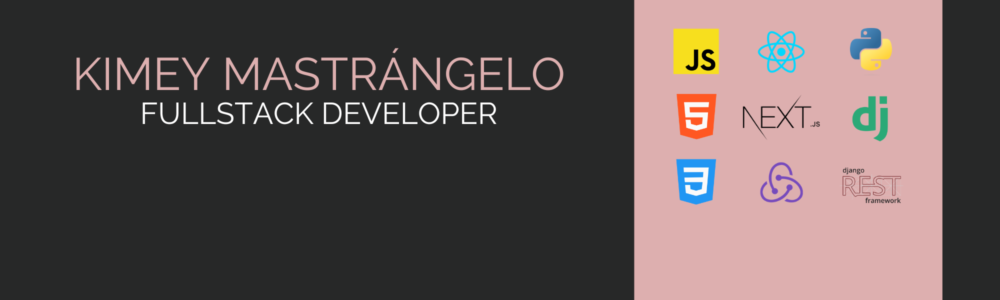

## 👩🏻‍💻 Kimey Mastrángelo | FullStack Developer

Hi there! I'm a FullStack Developer and Information Systems Engineering student with experience in projects for companies like **Toyota**, **Lexus**, **Aramco**, among others. I primarily work with **React**, **Next.js**, **Django**, and **Django REST Framework**, delivering complete solutions from frontend to backend.

I'm known for my **organization**, **autonomy**, and **professional commitment**. I also have experience working in agile environments, building reusable components, consuming REST APIs, and customizing CMS platforms like Wagtail.

🌎 Based in Rosario, Argentina — open to remote or hybrid opportunities worldwide.

---

### 🛠️ Tech Stack

**Languages** 

**Frameworks & Libraries** 

**Tools & Testing** 

---

### 🌟 Featured Projects

<table>
  <tr>
    <td>🚗 <a href="https://toyota.cl">Toyota</a></td>
    <td>🚗 <a href="https://www.lexus.cl">Lexus</a></td>
    <td>⛽ <a href="https://www.aramcoestaciones.cl/">Aramco Estaciones</a></td>
  </tr>
  <tr>
    <td>🚗 <a href="https://kinto-mobility.cl">Kinto Mobility</a></td>
    <td>🚗 <a href="https://autonauta.cl">Autonauta</a></td>
    <td>⚫ <a href="https://egodesign.io">EGO Design</a></td>
  </tr>
  <tr>
    <td>🚜 <a href="https://www.sullairargentina.com/">Sullair</a></td>
    <td>🪞 <a href="https://realfacevalue.eu/">RealFaceValue</a></td>
    <td>💲 <a href="https://www.max.capital/">MaxCapital</a></td>
  </tr>
</table>  

---

### 📢 Let’s Connect
  
  

